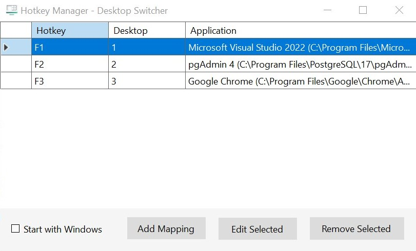
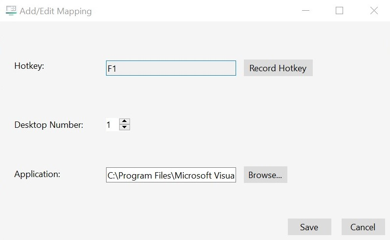

# Windows Desktop Switcher

A utility for Windows 10/11 that binds hotkeys to specific Virtual Desktops and their designated applications. Switch workspaces and focus on your apps with a single key press.

---

## Key Features 

* **Direct Desktop Switching:** Jump directly to any virtual desktop (e.g., F1 → Desktop 1, F2 → Desktop 2) instead of cycling through them.
* **Smart App Handling:**
    * Automatically focuses the designated app if it's already running on that desktop.
    * Launches the app if it's not found on that desktop, leaving instances on other desktops untouched.
* **Full UI Management:** An intuitive settings panel to add, edit, and remove your hotkey mappings without manually editing config files.
* **System Tray Integration:** Runs silently in the background and is fully accessible via a system tray icon.
* **Persistent Configuration:** All mappings are saved to a simple `config.json` file.

## Screenshots


**Main Hotkey Manager**
*The main window provides a clear list of all your current mappings. From here you can add, edit, or remove any hotkey.*


---


**Add/Edit Mapping Dialog**
*A simple dialog allows you to record a hotkey, set the target desktop number, and browse for the application executable.*


---

## Installation

1. **[⬇️ Download the Latest Release](https://github.com/KianFatemi/Window-Desktop-Switcher/releases/latest)**
2. From the latest release page, find the **Assets** section.
3. Download the `WindowDesktopSwitcher.exe` file.
4. Run `WindowDesktopSwitcher.exe`. The application will start in your system tray.

---

## How to Use

1.  **Launch the application.** It will start automatically in your system tray.
2.  **Open Settings.** Right-click the tray icon and select **"Settings"** to open the Hotkey Manager.
3.  **Add a New Mapping:**
    * Click the **"Add Mapping"** button.
    * Click the **"Record Hotkey"** button and press the key you wish to use (e.g., F9).
    * Set the **Desktop Number** you want to associate with this key.
    * Click **"Browse..."** to find and select the application executable (`.exe`).
    * Click **"Save"**.
4.  **Edit or Remove** mappings by selecting a row in the table and clicking the appropriate button.

Your changes are saved and take effect immediately, no restart required!

---

## Configuration File

While the UI is the recommended way to manage settings, the configuration is stored in a human-readable `config.json` file located in the same directory as the executable.

**Example `config.json`:**
```json
{
  "F1": {
    "desktop": 1,
    "exe": "C:\\Program Files\\Microsoft VS Code\\Code.exe"
  },
  "F2": {
    "desktop": 2,
    "exe": "C:\\Program Files\\Google\\Chrome\\Application\\chrome.exe"
  },
  "F9": {
    "desktop": 4,
    "exe": "C:\\Windows\\System32\\notepad.exe"
  }
}
```

---
## Building from Source
### Prerequisites
* Visual Studio 2022

* .NET 8 SDK

### Steps
1. Clone the repository:

```bash
git clone https://github.com/KianFatemi/Window-Desktop-Switcher.git
```

2. Open the `WindowDesktopSwitcher.sln` file in Visual Studio.

3. Restore the NuGet packages (this should happen automatically).

4. Build and run the project (press F5).
---
## License
This project is licensed under the MIT License. See the `LICENSE` file for details.